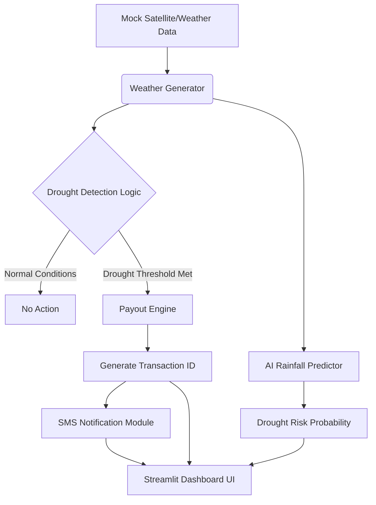

# CROP INSURANCE PAYOUT AGENT

## 1. Problem Statement
Agricultural communities are highly vulnerable to unpredictable weather patterns such as prolonged droughts. Traditional crop insurance claims processes are slow, manual, and often bureaucratic, delaying critical financial support to farmers when they need it most. 

## 2. Objectives
- Automatically monitor weather anomalies (like droughts) using data.
- Autonomously trigger insurance payouts via smart contracts without manual claim filing.
- Provide a transparent ledger of transactions.
- Use AI to predict upcoming drought risks for proactive measures.

## 3. System Architecture

## 4. Workflow Explanation
1. **Data Generation**: The synthetic weather module generates realistic timeseries data for selected farmers, factoring in natural patterns and anomalous dry spells.
2. **AI Forecast**: A lightweight Machine Learning model identifies historical patterns to project 5-day rainfall predictions.
3. **Continuous Monitoring**: The agent constantly checks the latest moisture and rainfall figures against user-configured thresholds.
4. **Trigger & Ledger**: If drought is confirmed, a simulated ₹5000 payout is logged into a structured dataframe to prevent duplicate fraud.
5. **Notification**: Farmers receive simulated SMS alerts confirming the automated transaction.

## 5. Mock Dataset Explanation
As real-time APIs like NASA POWER or IMD have rate limits and require complex API keys, a synthetic generator (`weather_generator.py`) is used for this proof-of-concept.
- **Fields Description**:
  - `Date`: Timestamp of record.
  - `Rainfall (mm)`: Daily precipitation (0-100mm).
  - `Temperature (°C)`: Daily high (20-45°C).
  - `Soil Moisture (%)`: Ground moisture saturation (10-80%).
  - `District`: Geographical region.
  - `Farmer ID`: Unique identifier.
- **Value Assumptions**: Data is engineered to simulate random exponential rain patterns, interrupted by mathematically generated "dry spells" where temperature spikes and soil moisture degrades linearly over consecutive days. 

## 6. Requirements
- **Functional Requirements**:
  - Generate 30-60 days dataset.
  - Interactive dashboard to configure thresholds.
  - Prevent duplicate payouts for the same drought event.
  - Visual analytics of historical data.
- **Non-Functional Requirements**:
  - Modular, clean codebase.
  - Fast simulation without network bottlenecks.

## 7. Languages & Tools Used
- **Python**: Core programming language.
- **Pandas**: Fast tabular data manipulation and ledger creation.
- **Streamlit**: Rapid UI and dashboard development.
- **scikit-learn**: Linear Regression model for AI prediction.
- **numpy**: Numerical operations for mock data.

## 8. Future Enhancements
- **Real Satellite API Integration**: Link actual NASA POWER, IBM Weather or local meteorological APIs.
- **Government DB Integration**: Authenticate Farmer IDs against national agricultural databases.
- **Blockchain Ledger**: Replace Pandas dataframe with Ethereum/Polygon smart contracts for immutable, decentralized payouts.
- **SMS Gateway Integration**: Hook into Twilio or AWS SNS for real-world SMS delivery.

## 9. How to Run Instructions
1. Ensure Python 3.8+ is installed.
2. Install dependencies: `pip install -r requirements.txt`
3. Launch application: `streamlit run app.py`
4. Use the sidebar to generate data and adjust simulation thresholds.
